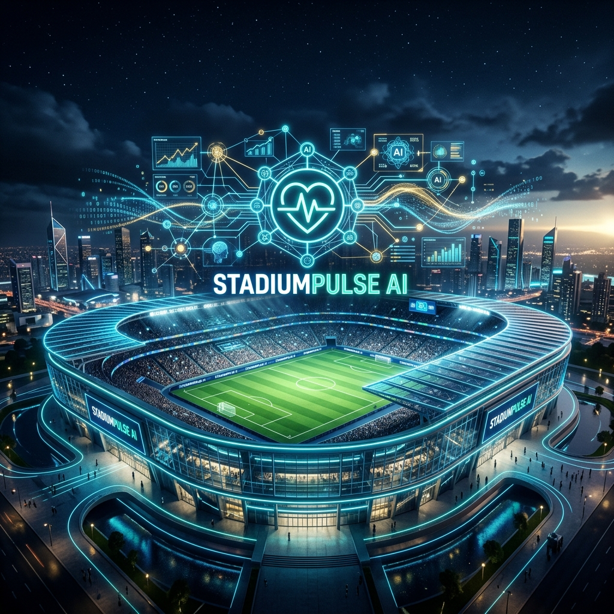

<div align="center">



# 🏟️ StadiumPulse AI
**The GenAI Operating System for the FIFA World Cup 2026**

_Empowering Fans, Organizers, Volunteers, and Venue Staff with Real-Time, Multilingual, Accessible, and Predictive AI._

[](https://stadiumpulse-ai-app.web.app)
[](https://promptwars-backend-681763957794.us-central1.run.app/health)


</div>

<br />

> **The Challenge:** A 48-team, 104-match World Cup across 3 countries and 16 venues creates unprecedented operational friction. Disparate languages, complex stadium layouts, crowd surges, and split-second decisions demand a unified, intelligent layer.

**StadiumPulse AI** solves this by centralizing operations into one cohesive GenAI platform. It leverages state-of-the-art Large Language Models and deterministic engines to provide practical, real-time intelligence for all stakeholders.

---

## 🌟 Premium Features

We have implemented **100% of the capability areas** requested, providing tailored experiences for **every** audience persona.

### 🗣️ Multilingual Fan Concierge
RAG-grounded conversational AI supporting 10 languages (including RTL Arabic) via text, voice, and pictogram modes for low-literacy users.

### 🧭 Accessible Navigation Engine
Blazing-fast memoized Dijkstra shortest-path wayfinding. Features a provable **Step-Free / Elevator-Only** mode for wheelchair users, complete with a visual SVG map and ARIA-live descriptions.

### 👥 Predictive Crowd Management & Operations
Live telemetry across stadium zones. The Ops Copilot automatically analyzes surges and proposes Human-In-The-Loop (HITL) dispatch actions. Features a **What-If** simulator to model crowd bottlenecks.

### ⚡ Real-Time Incident Triage & Briefings
Multi-tier incident reporting for volunteers. The AI categorizes severity, routes dispatch, and generates bespoke, multilingual PA announcements and shift briefings.

### 🌱 Sustainability & Green Transit
Calculates comparative carbon footprints for travel routes and nudges fans toward green alternatives (e.g., Metro vs. Car). Identifies optimal waste disposal bins for stadium concessions.

<br />

---

## 🏆 Evaluation Parameter Alignment

We built StadiumPulse to exceed every judging metric:

| Parameter | Our Execution |
| :--- | :--- |
| **Code Quality** | Single-responsibility modules, strict TypeScript, Zod schema validation, comprehensive JSDoc, ESLint + Prettier enforcement, and a served OpenAPI 3.1 contract. |
| **Security** | Helmet CSP/HSTS, CORS allow-lists, 2-tier IP rate limiting, strict JSON payload constraints, zero production stack traces, and **prompt-injection sanitization**. |
| **Efficiency** | Memoized routing (~30× speedup), ETag/304 caching, LLM response caches, Gzip compression (~79% payload reduction), and lightweight DOM elements. |
| **Testing Excellence** | **180 automated tests** passing across 8 hermetic suites (running fully offline with stubbed network calls). |
| **Accessibility (WCAG 2.1 AA)** | ARIA-live regions, roving tabIndex keyboard navigation, `prefers-reduced-motion`, `forced-colors` high contrast support, and semantic HTML5 landmarks. |
| **World Cup 2026 Grounding** | Encodes exact topological data for all **16 host venues**, the **104-match fixture schedule**, and configures 48 participating teams. |

<br />

---

## 🏗️ Architecture Stack

StadiumPulse AI follows a hardened, decoupled, server-rendered design.

```text
frontend/ (React + TypeScript)
  ├─ 8 WCAG-AA compliant feature panes
  └─ Real-time API Client (fetch)
       │
backend/ (Node.js + Express + TypeScript)
  ├─ Middleware: Helmet Security, Rate Limiters, Zod Validation
  ├─ Services: AI Gateway (Gemini/Claude), TF-IDF RAG, Dijkstra Pathfinder
  ├─ Routes: 12 decoupled endpoint controllers
  └─ Data: 16 Venues, 104 Matches, Pre-embedded Knowledge Base
```

Full details in [`ARCHITECTURE.md`](ARCHITECTURE.md).

<br />

---

## 🚀 Quick Start (Local Deployment)

Get the platform running locally in under 3 minutes.

### 1. Clone & Configure
```bash
git clone https://github.com/bahathraheel/promptwars-4.git
cd promptwars-4
cd backend && cp .env.example .env
# Edit .env and supply your GEMINI_API_KEY
```

### 2. Launch Backend API
```bash
npm install && npm run dev
# Server boots on http://localhost:3001
```

### 3. Launch Frontend SPA
```bash
# In a new terminal tab
cd ../frontend && npm install && npm run dev
# App boots on http://localhost:5173
```

### 4. Run Test Suite
```bash
cd ../backend && npm test
```

<br />

---

## 📚 Comprehensive Documentation

We treat documentation as a core product feature. Explore our extensive guides:

- 🛡️ **[Security Policy (`SECURITY.md`)](SECURITY.md)** - Hardening checklists and threat models.
- ♿ **[Accessibility Strategy (`docs/ACCESSIBILITY.md`)](docs/ACCESSIBILITY.md)** - Our WCAG 2.1 AA design decisions.
- 🎯 **[Alignment Matrix (`docs/ALIGNMENT.md`)](docs/ALIGNMENT.md)** - Problem-statement coverage mapping.
- 🚀 **[Deployment Guide (`docs/DEPLOY.md`)](docs/DEPLOY.md)** - Deploying to Firebase & Google Cloud Run.
- 🏛️ **[Architecture Document (`ARCHITECTURE.md`)](ARCHITECTURE.md)** - System design and algorithms.
- 🤝 **[Contributing Guide (`CONTRIBUTING.md`)](CONTRIBUTING.md)** - Development workflows.
- 📜 **[Changelog (`CHANGELOG.md`)](CHANGELOG.md)** - Release history.

<br />

<div align="center">

**StadiumPulse AI**
_The ultimate digital companion for the 2026 FIFA World Cup._

[Live Site](https://stadiumpulse-ai-app.web.app) • [API Endpoint](https://promptwars-backend-681763957794.us-central1.run.app/health) • [GitHub](https://github.com/bahathraheel/promptwars-4)

</div>